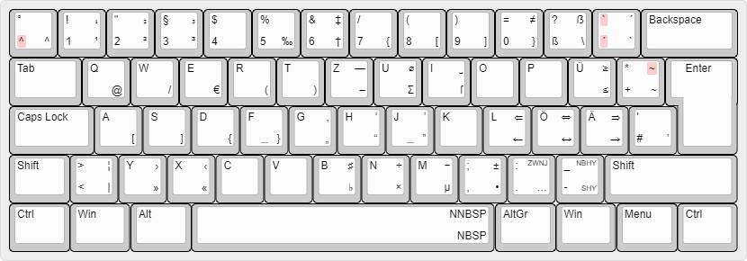

# scyDE – erweitertes deutsches Tastaturlayout

**Note for English speakers:** This project provides an extended version of the normal German keyboard (as used in Germany), geared towards programmers and typophiles. As its intended audience is German, this document is currently provided in German only. If you think that’s a mistake, feel free to translate this document and submit a pull request.

## Zielgruppe

Dieses Projekt stellt ein erweitertes deutsches Tastaturlayout zur Verfügung und richtet sich vorrangig an Softwareentwickler*innen und Typophile, also Leute, denen korrekte Typographie in ihren maschinengeschriebenen Texten wichtig ist.

## Systemvoraussetzungen

* Microsoft Windows (getestet unter Windows 10)

Eine Portierung auf andere Betriebssysteme werde ich vornehmen, wenn ich sie aktiv nutze. Gerade bei Linux dürfte das demnächst der Fall sein. Pull Requests werden gern genommen.

## Vorteile

* scyDE *erweitert* das bestehende deutsche Tastaturlayout. Alle Zeichen bleiben an ihren bekannten Positionen, es kommen nur neue hinzu.
  * Das [NEO](https://www.neo-layout.org/)‐Projekt pflegt beispielsweise ein komplett umgebautes deutsches Tastaturlayout, dessen Fokus vor allem auch auf Ergonomie liegt. NEO bietet weit mehr Zeichen als scyDE, aber hat dafür eine signifikante Lernkurve: Alle Zeichen (auch die Buchstaben) befinden sich an komplett anderen Positionen.
* Im Gegensatz zu [WinCompose](https://github.com/samhocevar/wincompose), das ebenfalls einen größeren Zeichenumfang bietet, werden (fast) alle Zeichen in scyDE ganz „normal“ über <kbd>Alt Gr</kbd> in Kombination mit einer Buchstaben‐ oder Ziffertaste aufgerufen und nicht mit mehreren aufeinanderfolgenden Tastendrücken.
* Einige Zeichen sind zusätzlich zu ihren normalen Positionen auch an „bequemeren“ Orten erreichbar. So finden sich beispielsweise die zum Programmieren wichtigen `{[]}` auch auf <kbd>Alt Gr</kbd>+`asdf`.
* Die auf deutschen Tastaturen üblicherweise als [Tottasten](https://de.wikipedia.org/wiki/Tottaste) ausgeführten Zeichen ^, ` und ´ gibt es in scyDE zusätzlich in einer untoten(?) Variante. Die meist nicht tote Tilde (~) gibt es zusätzlich in tot.

## Zeichenvorrat

scyDE bietet folgende zusätzliche Zeichen:

* Auslassungspunkte (…)
* Versal-Eszett (ẞ) und langes s (ſ)
* das geschützte Leerzeichen in der üblichen und einer schmalen Form (wie beispielsweise zwischen „z. B.“ empfohlen)
* typographisch korrekte Anführungszeichen in „doppelt“ und ‚einfach‘ sowie auch in der “englischen” ‘Fassung’
* Chevrons in »doppelt« und ›einfach‹ (und zwar im Gegensatz zu Mac‐Tastaturen in der richtigen Reihenfolge)
* Viertel‐, Halb‐ und Geviertstriche (‐, –, —)
* den bedingten Trenn‐ und den geschützten Bindestrich sowie den Bindehemmer
* mathematische Zeichen für Laien, nämlich `×`, `÷`, `Σ`, `⌀`, `‰`, `‌±`, `≤`, `≥` und `≠`, sowie `≈` über die tote Tilde
* 1, 2 und 3 in hoch‐ und tiefgestellter Variante
* das Aufzählungszeichen (Bullet, •) sowie Kreuz (†) und Zweibalkenkreuz (‡)
* die wichtigsten Pfeile für Fließtext: ← ↔ → und ⇐ ⇔ ⇒
* ã, ñ, õ, Ã, Ñ und Õ (über die tote Tilde)
* das Zeichen ␣ als sichtbares Leerzeichen
* ♯ und ♭

Hier das Layout in grafischer Form:

* Die Tasten sind links mit der Belegung ohne, rechts mit <kbd>Alt Gr</kbd> beschriftet. Oben befindet sich die Beschriftung für mit, unten für ohne <kbd>Shift</kbd>.
* Tottasten sind rot markiert.
* Einige nichtdruckbare Zeichen sind mit Abkürzungen aufgeführt:
  * NBSP: geschütztes Leerzeichen *(non‐breaking space)*
  * NNBSP: schmales geschütztes Leerzeichen *(narrow non‐breaking space)*
  * SHY: bedingter Trennstrich *(soft hyphen)*
  * NBHY: geschützter Bindestrich *(non‐breaking hyphen)*
  * ZWNJ: Bindehemmer *(zero‐width non‐joiner)*
* Die Zeichen auf <kbd>R</kbd> und <kbd>T</kbd> sind auf der Grafik nicht so einfach zu unterscheiden. Auf <kbd>R</kbd> liegen Viertelgeviertstrich und (mit <kbd>Shift</kbd>) Minuszeichen, auf <kbd>T</kbd> Halbgeviert‐ und (mit <kbd>Shift</kbd>) Geviertstrich.
* Die Akzente links von Backspace sind in der nicht‐toten Variante (mit <kbd>Alt Gr</kbd>) vertauscht. Das ist Absicht: Der sonst nur in Kombination mit <kbd>Shift</kbd> erreichbare Gravis wird beim Programmieren weit häufiger benutzt als der Akut.
* Die Grafik wurde mit `keyboard-layout-editor.com` erstellt, Informationen zur Anpassung findest du (auf Englisch) in [doc/chart.md](https://github.com/scy/scyDE/blob/master/doc/chart.md).

## Status

Das aktuelle Layout wird von mir **testweise** im täglichen Einsatz benutzt. Es ist möglich, dass sich die Position einzelner Zeichen noch einmal ändert, daher tragen Releases noch eine `0.x` als Versionsnummer. Insbesondere:

* Die Benutzung von Viertelgeviertstrichen (`U+2010 HYPHEN`) als „Standard“‐Bindestriche in Computersystemen macht womöglich mehr Ärger gegenüber dem verbreiteten Bindestrich‐Minus aus ASCII, als es tatsächlich bringt. Daher ist die Verwendung der prominenten Stelle <kbd>Alt Gr</kbd>+<kbd>R</kbd> vielleicht ungerechtfertigt. Wenn der Viertelgeviert von dort verschwindet, werden die Kombinationen mit <kbd>R</kbd> und <kbd>T</kbd> wahrscheinlich noch mal umsortiert.
* Nach nur einigen Stunden mit Experimenten habe ich den Eindruck, dass für die häufige Nutzung der Anführungszeichen und Chevrons ihre Position bei `yxcvb` vielleicht ungeeignet ist.
* In der Windows‐Version von IntelliJ konflikten <kbd>Alt Gr</kbd>+<kbd>Shift</kbd> zusammen mit <kbd>C</kbd>, <kbd>V</kbd> und <kbd>T</kbd> mit nützlichen Shortcuts, weil offensichtlich kein Unterschied zwischen <kbd>Strg</kbd>+<kbd>Alt</kbd> und <kbd>Alt Gr</kbd> gemacht wird. Vielleicht möchte ich diese Positionen lieber frei lassen. <kbd>L</kbd> und <kbd>N</kbd> sind zwar auch belegt, aber mit weniger wichtigen Funktionen.

## Installation

Du findest ein ZIP‐File mit einem Installationsprogramm im [Releases‐Bereich bei GitHub](https://github.com/scy/scyDE/releases). Pack das File aus und starte die `setup.exe` darin.

## Build‐Prozess

Wenn du Binaries von Fremden nicht vertraust (gut so!), kannst du das Layout auch aus der Quelldatei selbst bauen. Momentan ist der Build-Prozess für Windows manuell, aber auch sehr simpel.

**Wichtig:** Unbequemerweise lässt sich dieser Prozess nicht starten, wenn scyDE aktuell auf deinem Computer installiert ist. Du musst es also vorher über den in Windows üblichen Weg deinstallieren.

- Installiere den [Microsoft Keyboard Layout Creator](https://msdn.microsoft.com/en-us/globalization/keyboardlayouts.aspx).
- Öffne die Datei `src/scyDE.klc` aus diesem Repository mit ihm (über *File* → *Load Source File…*).
- Wähle *Project* → *Build DLL and Setup Package*. Ein Log mit Warnungen sowie das Installationspaket werden erstellt.
  * Die Warnung zu `is not in the default system code page (1252)` kann ignoriert werden; viele der verwendeten Zeichen kommen nur in Unicode vor und können daher in Windows-1252 nicht gefunden werden.
  * Auch `is already defined more than once` ist vernachlässigbar, da wir ja absichtlich Zeichen doppelt definieren.
  * `This key may not be present on all keyboards` bezieht sich auf Tasten, die nur auf einer (physisch) deutschen Tastatur an dieser Stelle sind. Eine solche hast du aber hoffentlich.
  * `By convention, the last entry in the dead key table for … (U+007e) should be a space` ist legitim; da muss ich noch nacharbeiten. Ein Leerzeichen in den Dead‐Key‐Tabellen gibt es, aber es steht nicht an letzter Stelle. Funktioniert trotzdem.
- Im erstellten Ordner findest du `.msi`‐Files und DLLs für verschiedene Prozessorarchitekturen, von denen die jeweils richtige bei der Installation ausgewählt wird. Ein Doppelklick auf `setup.exe` sollte den Installationsprozess starten.

## Autor und Lizenz

Dieses Tastaturlayout wurde erstellt von Tim Weber (@scy). Die Projektseite findet sich unter <https://github.com/scy/scyDE>.

Das Projekt ist gemeinfrei (public domain).
